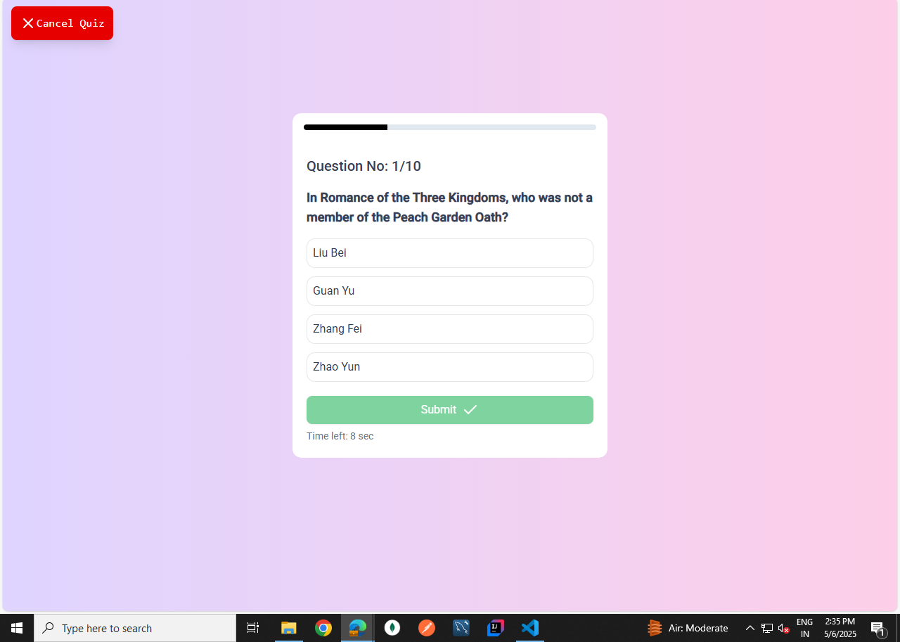
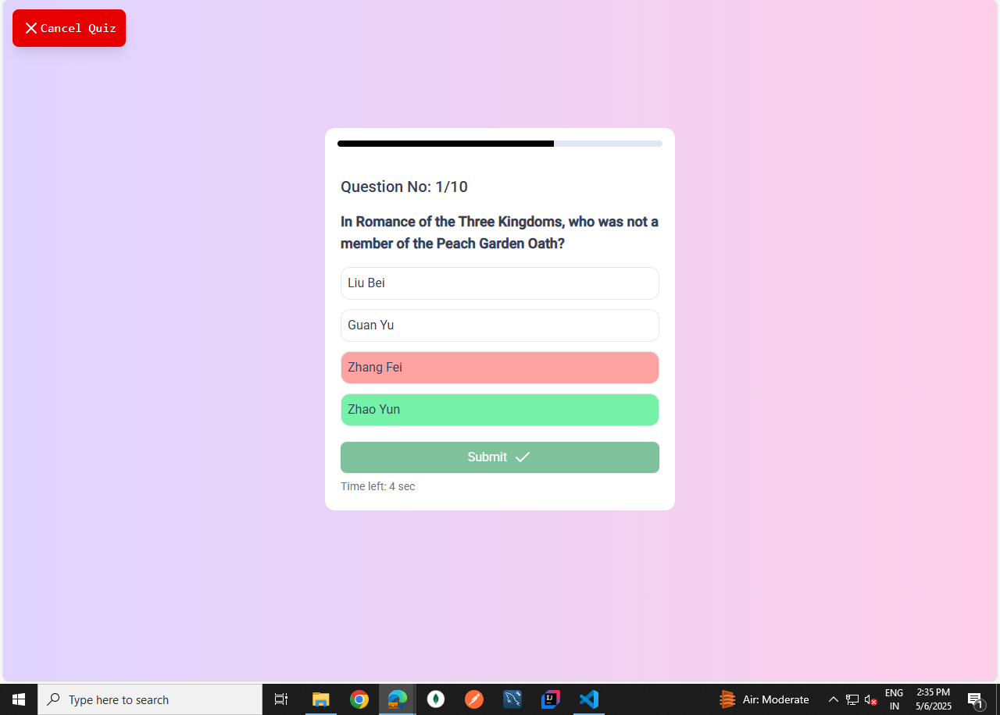

# Frontend
### Based on : 
- **Frontend** - Angular, Tailwind, Prime Ng Component
- **Backend** -  API Fetched from Open Triva Db([Websitelink](https://opentdb.com/))

This project was generated using [Angular CLI](https://github.com/angular/angular-cli) version 19.2.7.


## Images - 







## Dependencies
```bash
npm i --legacy-peer-deps
```

## Development server

To start a local development server - frontend, run:

```bash
npm start
```

Once the server is running, open your browser and navigate to `http://localhost:4200/`, for frontend -  The application will automatically reload whenever you modify any of the source files. 
